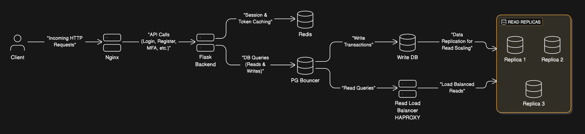
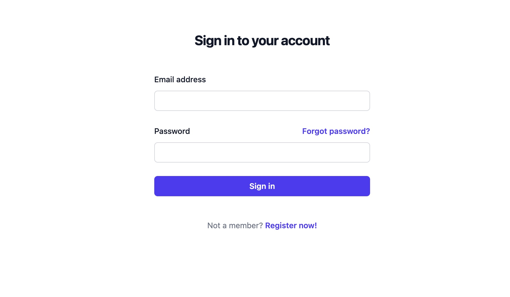
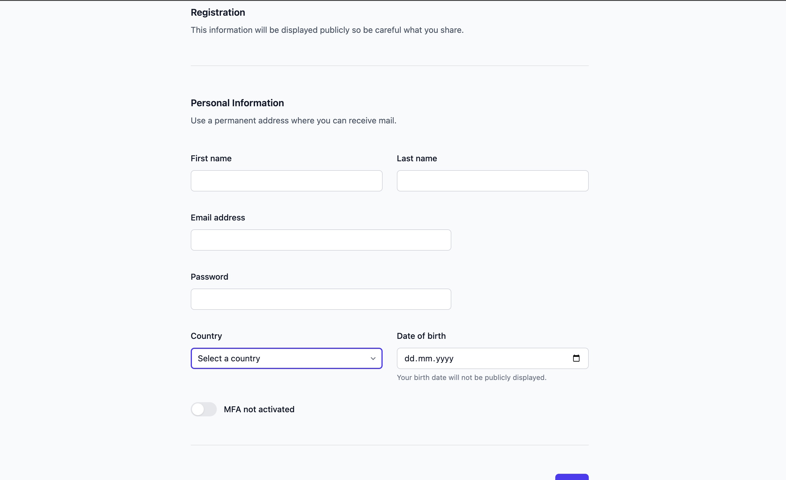
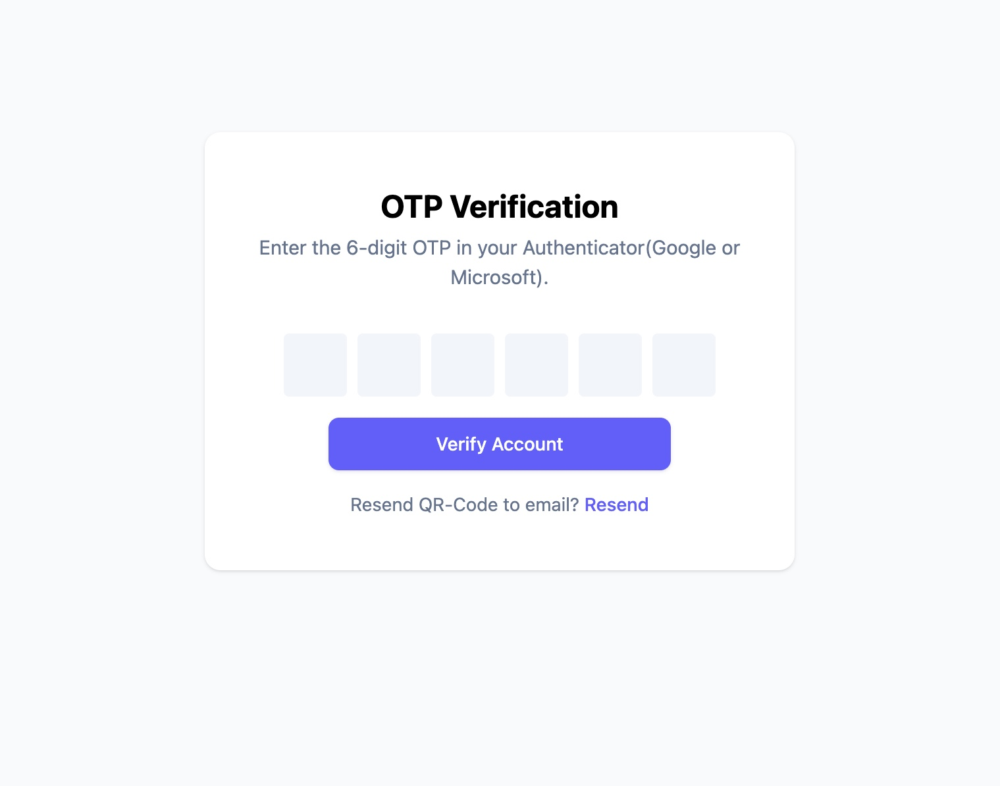
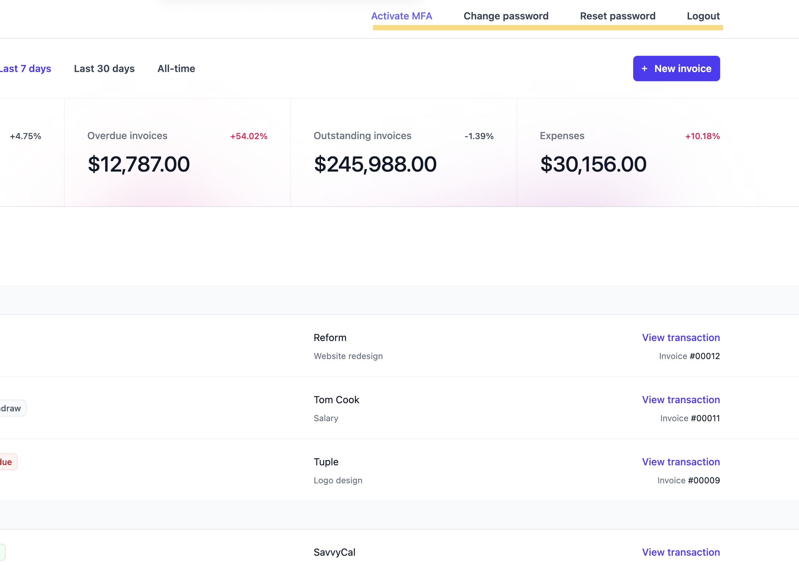
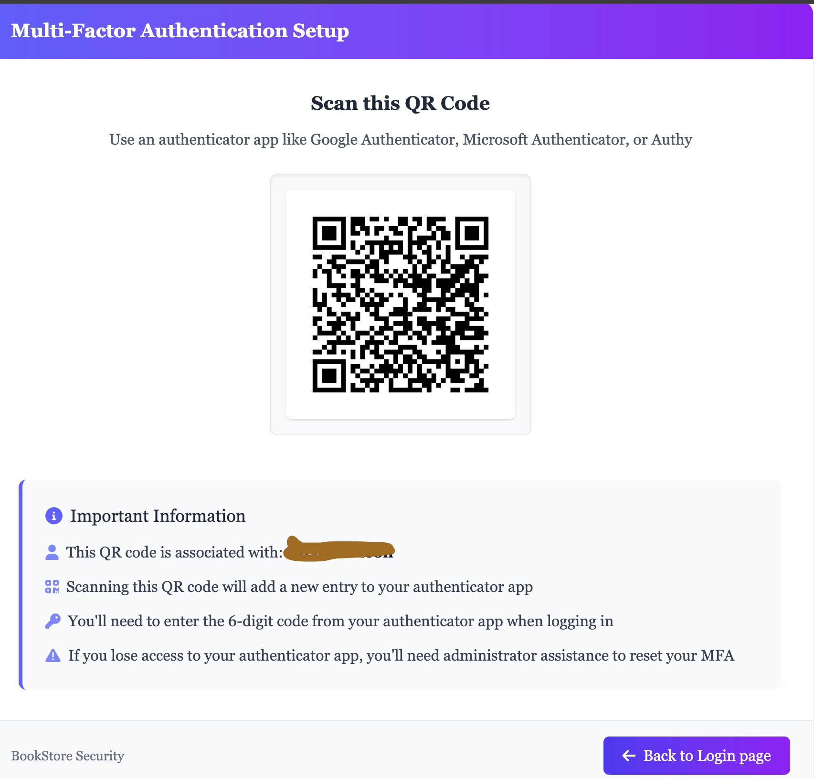

# Scalable Authentication Service

[](https://github.com/LeonR92/BookStore/actions/workflows/ci.yml)


A production-ready authentication service demonstrating enterprise-level architecture and security practices.

## Architecture Overview


This authentication service implements a robust, scalable architecture using:

- **Database Layer**
  - PostgreSQL with 1 write replica and 3 read replicas
  - HAProxy for intelligent read query distribution
  - PGBouncer for connection pooling
  - Repository pattern for clean data access abstraction

- **Caching & Performance**
  - Redis for session management and token storage
  - Nginx for request handling and static asset serving
  - Optimized Docker Compose configuration

- **Application Layer**
  - Flask-based modular Blueprint architecture
  - Dependency injection for service composition
  - Comprehensive error handling and logging
  - Separate read/write database connections for optimal performance

- **Frontend**
  - TailwindCSS for responsive dashboard UI
  - Minimal design focused on authentication flows
  - Dynamic form validation

## Security Features

- **Multi-Factor Authentication (MFA)**
  - Optional MFA during registration
  - PyOTP integration for time-based one-time passwords
  - User-controlled MFA activation/deactivation
  - QR code generation for authenticator app setup

- **Rate Limiting**
  - Request throttling to prevent brute force attacks
  - IP-based and account-based rate limiting strategies
  - Exponential backoff for repeated failed attempts

- **Honeypot Protection**
  - Invisible form fields to catch automated submissions
  - Automated flagging of suspicious authentication attempts
  - Silent failure mode to prevent attack enumeration

- **Session Management**
  - Redis-backed secure session storage
  - Configurable session expiration
  - Forced re-authentication for sensitive operations

## Development Practices

- **Continuous Integration**
  - GitHub Actions workflow for automated testing
  - pytest suite covering critical authentication paths
  - Code quality and security scanning

- **Containerization**
  - Multi-service Docker Compose setup
  - Optimized initialization sequence
  - Network isolation between service layers
  - Health checks for service dependencies

- **Code Quality**
  - Ruff for linting and code formatting
  - Type annotations throughout codebase
  - Comprehensive docstrings
  - Clean architecture with separation of concerns

## Observability
- Native Flask logging before each request
- Prometheus metrics exposed at `/metrics`
- Grafana dashboard available at `localhost:3000`
- Custom metrics for authentication events and rate limiting

## Getting Started

```bash
# Clone the repository
git clone https://github.com/LeonR92/BookStore.git
cd BookStore

# Start the services
docker-compose up --build
```

Visit `http://localhost:80` to access the authentication dashboard.
Visit `http://localhost:3000` to access the Grafana dashboard.

## Screenshots

### Login Page

### Registration Page with MFA Option

### OTP input

### MFA Page (Dummy dashboard, only the highlighted functions work)

### MFA Setup Flow



## License

[MIT](LICENSE)